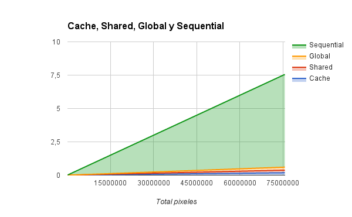

# Comparacion entre una implementacion secuencial (CPU), una paralela (CUDA), y una paralela usando Shared Memory (CUDA) para multiplicar 2 matrices

El tratamiento de imagenes es una de las aplicaciones en las que mas se emplean las GPU, debido a su capacidad de procesar matrices rapidamente y liberando a la CPU de esta carga.

Se puede evidenciar en reproductores de video, juegos de alta exigencia grafica y programas de edicion visual, que uno de los requisitos que suele aparecer es que la maquina tenga equipada una GPU.

En esta comparativa, se hace un analisis sobre un algoritmo secuencal y tres algoritmos sobre CUDA para efectuar el filtro de sobel.

Especificaciones:

- Intel(R) Core(TM) i7-3770K CPU @ 3.50GHz
- DUAL SLI NVIDIA GPU GeForce GTX 780
- 16 GB RAM

**Implementacion secuencial:** Para la implementacion secuencial se utiliza `malloc` y `free`, ademas de las funciones de `OpenCV`.

**Implementacion CUDA:** La misma gestion de memoria para la implementacion secuencial + `cudaMalloc` y `cudaMemcpy` para manejar la memoria del dispositivo.

**Implementacion CUDA & Shared Memory:** La misma gestion de memoria para la implementacion CUDA + `__shared__` y `__constant__` como decorator para declarar la memoria compartida en el device.

**Implementacion CUDA & Caché:** La misma gestion de memoria para la implementacion Shared + `Cache`

## Pruebas

Para las pruebas se utiliza un dataset de 9 imagenes que oscilan entre 1 y 4 MPx y una ultima imagen que mide 70MPx. Cada prueba se ejecutó cien veces para disminuir el ruido en os experimentos --se anexa su respaldo estadistico--

## Resultados

En la siguiente tabla se muestran los promedios para cada una de las 6 pruebas en las 3 implementaciones:

### Secuencial
| Tamaño (px)   | Media (s)  |
| ------------- | ---------- |
| 157360        | 0,000153   |
| 228000        | 0,000808   |
| 298820        | 0,002987   |
| 395200        | 0,007393   |
| 475410        | 0,015264   |
| 522000        | 0,113656   |
| 583440        | 0,251936   |
| 612480        | 0,650449   |
| 627000        | 1,270345   |
| 75659406      | 5,855701   |

### CUDA 32 threads
| Tamaño (px)   | Media (s)  |
| ------------- | ---------- |
| 157360        | 0,000054   |
| 228000        | 0,000190   |
| 298820        | 0,000258   |
| 395200        | 0,000409   |
| 475410        | 0,000678   |
| 522000        | 0,002949   |
| 583440        | 0,004793   |
| 612480        | 0,008839   |
| 627000        | 0,029355   |
| 75659406      | 0,025366   |

### CUDA 32 Threads - 32*32 Tiles
| Tamaño (px)   | Media (s)  |
| ------------- | ---------- |
| 157360        | 0,000140   |
| 228000        | 0,000128   |
| 298820        | 0,000193   |
| 395200        | 0,000286   |
| 475410        | 0,000628   |
| 522000        | 0,001329   |
| 583440        | 0,002048   |
| 612480        | 0,003624   |
| 627000        | 0,038325   |
| 75659406      | 0,008433   |

Los resultados se condensan en los siguiente grafico:

### Algoritmos paralelos

### Algoritmos paralelos y secuencial

## Conclusiones

- Con base a los resultados obtenidos, se puede concluir que, en general, para la multiplicacion de matrices presenta un mejor desempeño cualquiera de las dos implementaciones paralelas en comparacion a la implementacion secuencial.

- La transferencia de datos a traves del PCI Express representa la mayor parte del consumo de tiempo en la implementacion paralela con GPU. A pesar de eso, una pequeña porcion de datos es utlilizada en multiples operaciones paralelizables (en contraste a la suma), lo cual permite que dicho costo de transferencia sea compensado ampliamente por el ahorro en tiempo de computo de la GPU frente a la CPU.

- En general, la implementacion usando Shared Memory representa una mejora en tiempo, con respecto a su competidora nativa con Global Memory. Sin embargo en ocasiones, al superponer las capas de memoria compartida para acelerar el proceso, da lugar a que se generen tiles completas para procesar solo pequeñas porciones de la matriz original, caso en el cual se desperdicia tiempo de computo. Esto es que, la optimizacion con tiles funciona mejor cuando el tamaño de los tiles se ajust a bien al tamaño total de la matriz.

- Cuanta mayor cantidad de operaciones sea posible acelerar en GPU, y cuanta menor memoria sea necesaria transferir, mejor es el desempeño de la GPU.
