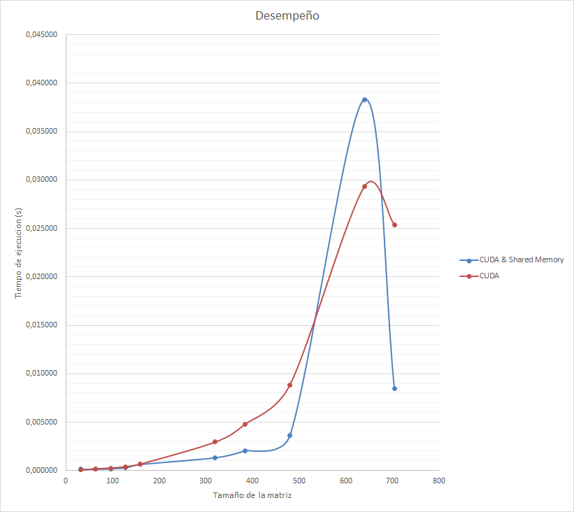
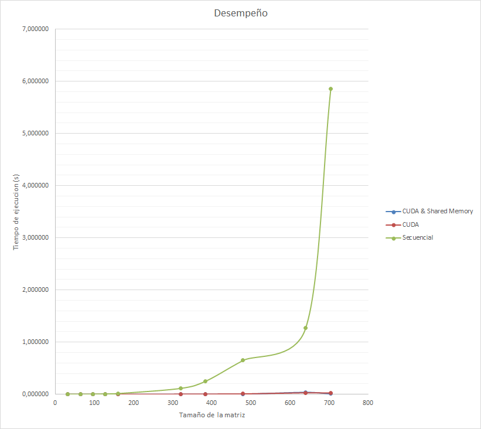

# Comparacion entre una implementacion secuencial (CPU), una paralela (CUDA), y una paralela usando Shared Memory (CUDA) para multiplicar 2 matrices

Uno de los algoritmos que mejor explota las capacidades computacionales de una GPU, es la multiplicacion matricial, debido a que las operaciones que se realizan son las mismas, solo que en diferentes sectores de memoria, ademas de que son altamente independientes.

En esta comparativa, se exponen tres algoritmos para la multiplicacion de matrices, uno implementado de manera secuencial en CPU, otro paralelizando con una GPU, y un ultimo (tambien en GPU) optimizado mediante el uso de memoria compartida.

Especificaciones:

- Intel(R) Core(TM) i7-3770K CPU @ 3.50GHz
- DUAL SLI NVIDIA GPU GeForce GTX 780
- 16 GB RAM

**Implementacion secuencial:** Para la implementacion secuencial se utiliza `malloc` y `free`.

**Implementacion CUDA:** La misma gestion de memoria para la implementacion secuencial + `cudaMalloc` y `cudaMemcpy` para manejar la memoria del dispositivo.

**Implementacion CUDA & Shared Memory:** La misma gestion de memoria para la implementacion CUDA + `__shared__` como decorator para declarar la memoria compartida en el device.

## Pruebas

Para las pruebas se utiliza un dataset de vectores que varian en 100, 1000, 10000, 100000, 1000000 y 10000000 posiciones. Cada prueba fue ejecutada 10 veces para disminuir el ruido. Al final se analiza el factor de aceleracion en base a los tiempos de ejecucion en cada algoritmo. Se anexa un conjunto de pruebas mas usando 1024 hilos (usando la implementacion paralela), contrastando con los 32 hilos de la implementacion original.

**Implementacion secuencial:** Ninguna mencion especial.

**Implementacion CUDA:** Se utilizan 32 hilos por bloque bidimiensional para ejecutar el proceso.

**Implementacion CUDA & Shared Memory:** Se utilizan 32 hilos por bloque bidimiensional para ejecutar el proceso. El tamaño de las 2 tiles es de 32*32 posiciones igualmente.

## Resultados

En la siguiente tabla se muestran los promedios para cada una de las 6 pruebas en las 3 implementaciones:

### Secuencial
| Tamaño (n) | Media (s)  |
| -----------| ---------- |
| 32         | 0,000153   |
| 64         | 0,000808   |
| 96         | 0,002987   |
| 128        | 0,007393   |
| 160        | 0,015264   |
| 320        | 0,113656   |
| 384        | 0,251936   |
| 480        | 0,650449   |
| 640        | 1,270345   |
| 704        | 5,855701   |

### CUDA 32 threads
| Tamaño (n) | Media (s)  |
| -----------| ---------- |
| 32         | 0,000054   |
| 64         | 0,000190   |
| 96         | 0,000258   |
| 128        | 0,000409   |
| 160        | 0,000678   |
| 320        | 0,002949   |
| 384        | 0,004793   |
| 480        | 0,008839   |
| 640        | 0,029355   |
| 704        | 0,025366   |

### CUDA 32 Threads - 32*32 Tiles
| Tamaño (n) | Media (s)  |
| -----------| ---------- |
| 32         | 0,000140   |
| 64         | 0,000128   |
| 96         | 0,000193   |
| 128        | 0,000286   |
| 160        | 0,000628   |
| 320        | 0,001329   |
| 384        | 0,002048   |
| 480        | 0,003624   |
| 640        | 0,038325   |
| 704        | 0,008433   |

Los resultados se condensan en los siguiente grafico:

### Algoritmos paralelos

### Algoritmos paralelos y secuencial

## Conclusiones

- Con base a los resultados obtenidos, se puede concluir que, en general, para la multiplicacion de matrices presenta un mejor desempeño cualquiera de las dos implementaciones paralelas en comparacion a la implementacion secuencial.

- La transferencia de datos a traves del PCI Express representa la mayor parte del consumo de tiempo en la implementacion paralela con GPU. A pesar de eso, una pequeña porcion de datos es utlilizada en multiples operaciones paralelizables (en contraste a la suma), lo cual permite que dicho costo de transferencia sea compensado ampliamente por el ahorro en tiempo de computo de la GPU frente a la CPU.

- En general, la implementacion usando Shared Memory representa una mejora en tiempo, con respecto a su competidora nativa con Global Memory. Sin embargo en ocasiones, al superponer las capas de memoria compartida para acelerar el proceso, da lugar a que se generen tiles completas para procesar solo pequeñas porciones de la matriz original, caso en el cual se desperdicia tiempo de computo. Esto es que, la optimizacion con tiles funciona mejor cuando el tamaño de los tiles se ajust a bien al tamaño total de la matriz.

- Cuanta mayor cantidad de operaciones sea posible acelerar en GPU, y cuanta menor memoria sea necesaria transferir, mejor es el desempeño de la GPU.
