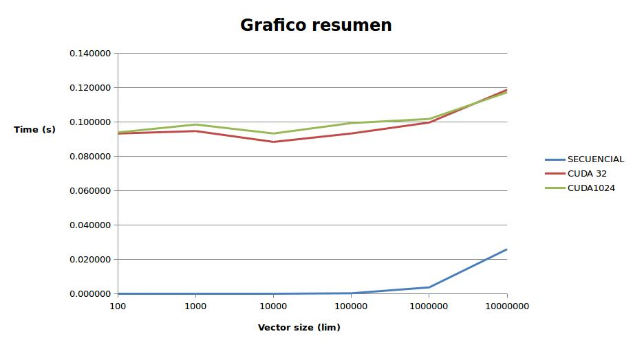

# Comparacion entre una implementacion secuencial (CPU) y otra paralela (CUDA) para sumar 2 vectores

En el ambito del estudio en el analisis de algoritmos, existe una diferencia marcada en el rendimiento que presentan las aplicaciones paralelizadas con respecto a las que solo usan un hilo.

En esta comparativa, se exponen dos algoritmos para la suma de vectores, uno implementado de manera secuencial en CPU y otro utilizando GPU.

Especificaciones:

- Intel(R) Core(TM) i7-3770K CPU @ 3.50GHz
- NVIDIA GPU Tesla K40c
- 16 GB RAM

**Implementacion secuencial:** Para la implementacion secuencial se utiliza `malloc` y `free`.

**Implementacion CUDA:** El mismo alojamiento para la implementacion secuencial + `cudaMalloc` y `cudaMemcpy` para manejar la memoria del dispositivo

## Pruebas

Para las pruebas se utiliza un dataset de vectores que varian en 100, 1000, 10000, 100000, 1000000 y 10000000 posiciones. Cada prueba fue ejecutada 10 veces para disminuir el ruido. Al final se analiza el factor de aceleracion en base a los tiempos de ejecucion en cada algoritmo. Se anexa un conjunto de pruebas mas usando 1024 hilos (usando la implementacion paralela), contrastando con los 32 hilos de la implementacion original

## Resultados

En la siguiente tabla se muestran los promedios para cada una de las 6 pruebas en las 3 implementaciones:

### Secuencial
| Tamaño (n) | Media (s)  |
| -----------| ---------- |
| 100        | 0.000001   |
| 1000       | 0.000005   |
| 10000      | 0.000049   |
| 100000     | 0.000417   |
| 1000000    | 0.003857   |
| 10000000   | 0.026056   |

### CUDA 32 Threads
| Tamaño (n) | Media (s)  |
| -----------| ---------- |
| 100        | 0.093371   |
| 1000       | 0.094815   |
| 10000      | 0.088516   |
| 100000     | 0.093428   |
| 1000000    | 0.099781   |
| 10000000   | 0.118817   |

### CUDA 1024 Threads
| Tamaño (n) | Media (s)  |
| -----------| ---------- |
| 100        | 0.094012   |
| 1000       | 0.098624   |
| 10000      | 0.093407   |
| 100000     | 0.099471   |
| 1000000    | 0.101861   |
| 10000000   | 0.117360   |

Los resultados se condensan en el siguiente grafico:

## Conclusiones

- Con base a los resultados obtenidos, se puede concluir que, en general, para la suma de vectores presenta un mejor desempeño la implementacion en CPU secuencial que la codificacion en CUDA.

- La transferencia de datos a traves del PCI Express representa la mayor parte del consumo de tiempo en la implementacion paralela con GPU.

- La transferencia de datos a traves del PCI Express representa la mayor parte del consumo de tiempo en la implementacion paralela con GPU, y por tanto, la suma vectorial no explota al maximo las capcidades de la computacion en paralelo

- Cuanta mayor cantidad de operaciones sea posible acelerar en GPU, y cuanta menor memoria sea necesaria transferir, mejora el desempeño de la GPU
